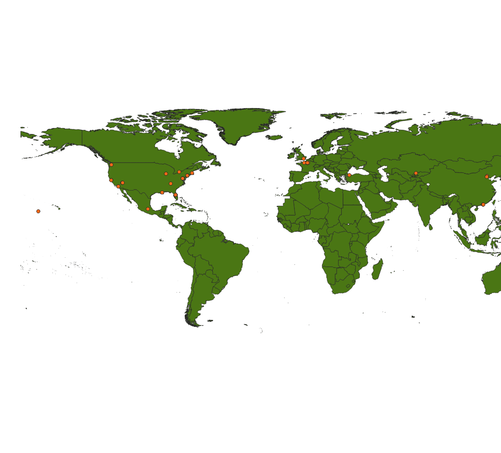

# Example of geospatial data analysis

Example using Apache Sedona with Spark to consume geospatial data about famous attractions coordinates.

## Description

This project analyze the 50 most visited tourist attractions in the world by coordinates with geometric point representation and calculate its distances between a let point. Furthermore, show the points wish are in United States (its boundary is represented by multipolygons).

## Resources

- [50 famous attractions](./src/test/resources/famous_attractions.csv): file in csv format with latitude (x) and longitude (y) values;
- [Country boundaries](./src/test/resources/famous_attractions.csv): file in csv format with boundaries values represented by multiploygons in WKT format.

## Data source

- [50 famous attractions](https://www.lovehomeswap.com/blog/destinations-inspiration/the-50-most-visited-tourist-attractions-in-the-world)
- [Country boundaries](https://datacatalog.worldbank.org/search/dataset/0038272/World-Bank-Official-Boundaries)

## 50 most famous attractions

